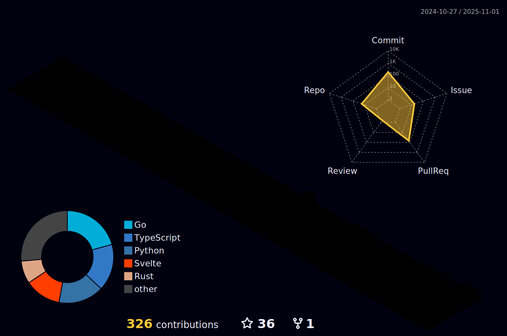

<h1 align="center">Hello</h1>
<h3 align="center">I am kaede :)</h3>

<h2>GitHub Stats</h2>

   

  

<h2> Qiita & Zenn</h2>

  
  

<h2> Lang</h2>

  
  
  
  
  
  
  
  

<h2>Github Trophy</h2>

  <a>

   

    

   
